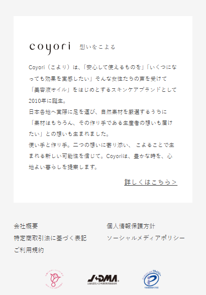
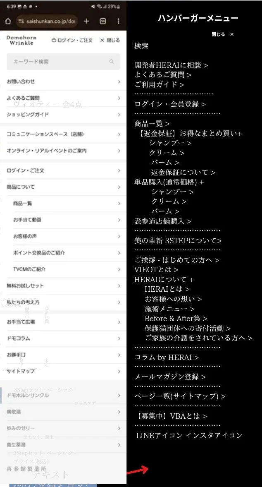
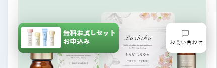

サイト制作依頼文
## ECサイト VIEOTY 制作依頼内容まとめ
ターゲット: 50歳女性 * コンセプト: 高級オーガニック **2. デザインイメージ** * 全体的な雰囲気: 上品で洗練された印象、高級感と親しみやすさのバランス
■パッケージ・ラベルイメージ
 
* **VIEOTY:** 箔押しシルバー
* **ロゴ:** #b2a2b9 (薄い紫)
* **その他の文字:** #231815 (黒)、#5d4037 (濃い茶色)、#79645e (紫がかった茶色)
ちなみに以下がイメージとなります。 

## 2024.12.09 MTG まとめ

↓ 初回依頼分作業内容の詳細

【修正対応まとめ】

- お問い合わせセクション
    - テキスト
    - Herai様確認

- フッター修正
    
    
    項目編集

- ハンバーガーメニューは下記構成の通りにしたい
    - 
    - リンクについてはわかる箇所でOK
    - ハンバーガーメニューの開閉もドモホルンリンクルっぽくしたい
    - 構成も画像でメールで送った通りにしたい

- コラム
    - → 画像はあとで変更可能

- 全体のフォント間をできる限り修正
    - h1-h6 等のフォントサイズや修正

- ブランドカラーはもう少し控えめで
    - ブランドカラーは 15% 程度
    - 商品部分はゴシック体にしたい。
    - SPで見ると Vieoty とはの部分が中央よせになっていない

- ユーザビリティ向上？
    - フッター。ハンバーガーメニュー等の項目整理＆修正

- お問い合わせポップアップ
    - イメージ↓
    - 

- 販売前商品紹介 修正
    - 文字サイズが全体的に大きいので修正
    - フォントを変更したい

- アニメーション
    - シャドウを追加してみる
    - なるべく https://www.coyori.com/ っぽくしたい

- 固定メニューの改善
    - 動作の参考は
    - https://www.saishunkan.co.jp/domo/

 

-------------------------------------------------------------------------
-------------------------------------------------------------------------

* トップページ: 30,000円 ベンチマークこより、まかない（税込 33,000円）
    * トップページのデザイン未、ハンバーガーメニュー未、フッター未、固定メニューの改善、未
    * コラムセクションの追加(済、画像の形相談)

    * 見出しと本文のフォント、フォントサイズをどの環境でも最適化(？)
    * サイト全体のカラー改善(未)
    * スマホ対応？
    
    * ユーザビリティ向上？
  
    * まとめ買い促進？
    * 全体のフォント・サイズ、カラーの変更(未)
    * 販売前商品紹介 修正
    * SEO対策？

* アニメーション制作/検索機能: 20,000円（税込 22,000円）
    例えば以下のような細かい?追加はいかがでしょうか?

・画面上部の紫の固定メニュー?、アイコンやロゴのサイズ感のベンチマーク:https://shop.lacasta.jp/shop/(黄色不要、赤右端、青が赤の左) 未
・スクロールに合わせた表示のベンチマーク:https://www.saishunkan.co.jp/domo/(サイトのように透過?させない、背景?バックグラウンドカラーは白) 未
・上記二点をもとに弊社サイト右から・三 探す ・カートアイコン・ログイン(https://vieoty.com/secure/?mode=myaccount_login&shop_id=PA01513282)
未

↑ここまで

↓これから
* LP（商品詳細ページ）: 50,000円（税込 55,000円）
*動画

↓見積もりにより検討
    *  * コンセプトページの改善
   * コラム一覧ページのデザイン、構成