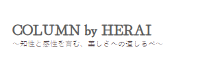

## 2024.12.16 MTG まとめ

【修正対応まとめ】

- お問い合わせセクション
    - テキスト
    - Herai様確認

- LINKはHTMLで？
    - Herai様対応

- 見出しの文字間隔英語適度に入れる
    - 
    - 紫のラベルは about vieoty にひく
    - Special Set のベージュラベルは削除 （美の革新3step は残す）

- トップページのカラー変更箇所
    - 美の革新3step
    - の色つきシャドウを変えたい
    - css で Herai 様が変更できるようにコメントつけておく
    - 色の変更可能箇所をコメントしておく CSSで

- セクションを区切る箇所以外のバックグラウンド？はグラデーションに(こより)
    - Special Sets 
    - .p-recommend-bg これを 共有の色に設定しておく
    - Special setも Regular price も
    - 左右の background の左右はけしておく

- About VIEOTY と ↓の部分
    - 画像の背景部分は消しておく（あとでもどせるように）

- アニメーションのタイミングが早い？
    - 下からだすようにしてみる + ちょっと遅延させてみる

- トップページアクセス時のロゴ画質が悪く見える(左から右にグラデーション？)
    - ロゴの画像を新しいもので差し替え
    - 左から→にロゴ表示させるように（できる限り フェードインさせる）

- お問い合わせをLINEのアイコンに(テキストはHERAIに相談)
    - Lineのアイコンにする
    - 文字を 『HERAIに相談』
    - リンクは Herai様なので コメントつけておく
    - CSS の先頭にまとめてなにがどこにあるかを書いておく

- サイズが合っていない？大きい？端末による？
    - bottom: 30px

- ヘッダー固定メニュー下部に文字色と同じアウトライン？を引いてに上部にブランドカラーのライン引く(ロクシタン:https://jp.loccitane.com/)
    - border-top: 4px solid #d7b7d8;
    - でシャドウは不要

- 各セクションの編集箇所キーワードを知りたい
    - CSSにコメントで書いておく

- 検索機能どこまでカスタムできるか？検索窓が重なっている、窓内に「キーワードで検索」、窓のすぐ下に小さく「※スペースで区切って複数検索が可能です。」を追加、
Googleロゴを出したくない、アイキャッチ設定は？検索補助(1文字入れたらキーワードがでてくる)、
トンマナ合わせ,、検索ヒットしない場合一致する結果はありませんだけではなく、ドモのように検索のヒントと「解決できなかった場合HERAIに直接ご連絡ください。」LINEアイコンまたは電話アイコン(お急ぎの方)

    - キーワード指定をしたい
    - 予測検索に不要なキーワードがでてしまう
    input に キーワードで検索を追加しておく
    - テキストで ※スペースで区切って複数検索が可能です。 を目立たないように追加
    - Google 検索と Google のロゴ画像を削除
    - 検索時のアイキャッチ画像を どこで画像指定できるのか調査
    背景色をなくす
        background-color

    一致する結果はありません → 
       「解決できなかった場合HERAIに直接ご連絡ください。」LINEアイコンまたは電話アイコン(お急ぎの方) を表示

- 検索キーワード解析できるか？
    - 後々

- 例えば送料と検索すると余計なページが表示される
    - 基本はトップにでてくるはず

- フッター、ハンバーガーメニュー＋について修正画像追加
    - 

    - HERAIについて+
        - HERAIとは
        - お客様への想い
        - 施術メニュー
        - Before & After集

    - ↓は別
        - 保護猫団体への寄付活動
        - ご家族の介護をされている方へ

    - 

- トップページ構成不要なものは非表示に、コラム画像は正方形でタップでリンク、一覧はこちらリンク、VIEOTYとは リンク
    - ギャラリー ＆ ポップギャラリーは非表示
    - News は非表示で
    - Instagram は ギャラリー のものを流用でOK
    - アニメーションは残す

- 最近ご覧になった商品
    - 画像は正方形に修正（横長になっている）  

- コラム一覧の画像は正方形に
    - リンクも設定できるように
    - 『下部にコラム一覧はこちら ->』を追加

- Shop（Vieoty Salon）
    - 画像を一つだけにしたい
    - テキスト
    - せんのボックスで囲む 詳しくはこちら

-------------------------------------------------------------------------
 今後のスケジュール
-------------------------------------------------------------------------

<< 2月にだしたい内容 - 残りタスク >>

- トップページ制作
    - 今日の修正内容
    - 今週中に対応
    -  ※ 1/15(20) までに TOP ページ と LP を終わらせたい

- 商品LP制作（再度見積もり）
    - 1月後半までに
    - イメージ相違と修正対応が割と多かったためデザインの段階でFixさせたい
    - デザイン再制作（既存のLPデザインをTopページ風に修正 +2万円程度）
    - コーディング（動きをつけたいとの話だったので程度によるのですが +2-3万円程度）
    - 参考サイト: https://www.kyusai.co.jp/lp?u=lp_cre_021a_adk
    - 参考サイトのクオリティだと 2-30万円かかるので参考サイトにあわせるのは難しい
    -  ※ 1/15(20) までに TOP ページ と LP を終わらせたい
    - LP長いのでコーディングに2週間程度はかかりそう
    - 今週からデザインはいらないと間に合わなそう？
    - 残り対応機関
        - 12/16-20: デザイン再制作
        - 12/23-26: デザイン修正期間
        - --年末年始--
        - 1/6-10: コーディング
        - 1/13-17: コーディング（修正含む）

- トップページの動画
    - 選定と編集 → 進める 今週中くらいで対応
    - 動画は後程　Herai様からもらえる

- 画像制作 7枚程度
    - 商品撮影 2カット（表と裏）
        - https://vieoty.com/?pid=183325336
        - ↑の商品画像のように
        - モデル半日と 商品撮影 2カット + 7枚程度
        - ※ 今月中に商品とどけば開始できる

    - 追加で モデルつきの画像（3枚程度）
        - 手のモデル 20-30代 の女性でOK
        - ネイルなし
    - 納期は 1/20以降でもOK
    

- 動画
   -  お風呂あがりの髪と肌の保湿をしている動画を撮りたい
    
    - ○ 動画の場合
        - Herai様立ちあいのもの （モデル） 40代前半にしたい（モデルさん手配の方向で）
        - モデル代 3万円程度 + スタジオ代 2万円程度 なのでコストがかさみそう

    - ○ 画像で対応する場合
        - コストがかかる場合画像でもよい？ 画像 or 簡易な gif であれば 弊社おまかせの 20代モデルでもよい
        - スタジオ等も不要

    - 納期は 1/20以降でもOK
    - → 一旦 Herai 様ご検討
    - → 年明けにまでに方針決めて頂く

- イラスト
    - 修正2-3回
        - 費用感: 3-4万程度
    - 納期
        - 1月末 - 2月頭あたり

