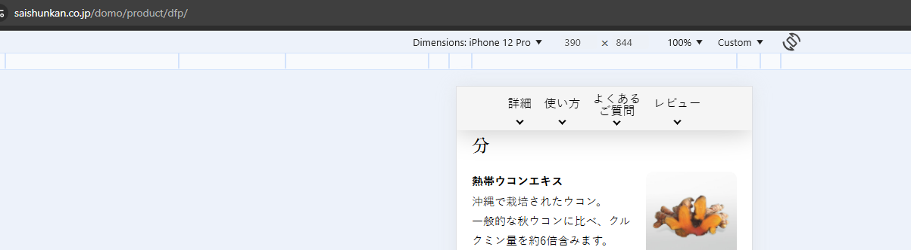
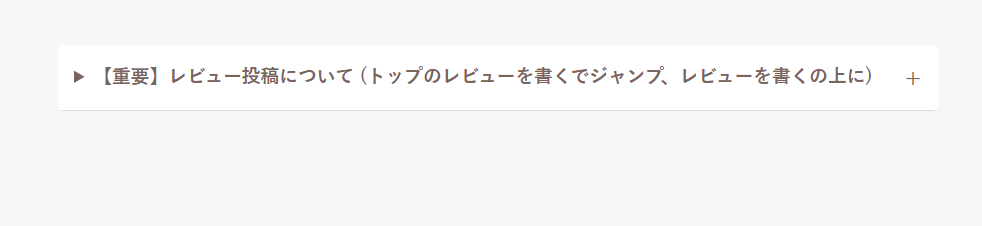
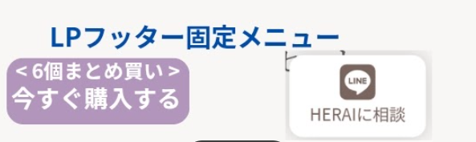

## 2025.01.07 MTG

【MTGまとめ】

- 商品LP だけはヘッダーの固定リンクをつける
    
    のイメージ
    vieoty のヘッダーと同様に紫ラインを入れる

    カートに入れるの↓に配置したい
    問い合わせまで（問い合わせで一般のヘッダーに切り替える）

- 商品の大きい画像をタップすると拡大縮小できるように

- 商品のレビュー数を表示したい（できるか調査？）

- レビューを見る を押下するとレビュー一覧の箇所にジャンプするように

- 内容量/使用目安 はコードべた書きでOK

- 税込み表記は小さくしたい。 他は現状のままでカラーも変えたい

- <a href="https://vioty.shop-pro.jp/customer/products/183325336/inquiries/new">開発者HERAIに問い合わせる</a>
    は削除、上下余白も削除（現行LP内部）

- 購入数は残す

『レビュー』
- いいね機能: できなそう
- ソート: いいねできなければ不要？

- レビューを書くの↓に

をいれたい

- CTA
    はラフの通りで作る

- 使用シーン内の
    使い方画像は複数枚で横スクロールできるようにしたい。

- 使用料の gif 画像をつくりたい
     2 - 3 枚程度

- デフォルトの 購入する / トップに戻る は不要
    
    を追加
    今すぐ購入するを押下するとカートに遷移するように

現状
    figam (商品の特徴)

    全成分 → テキスト書き換えだけでよさそう? → 確認

【画像について】
- 商品LP の モデル画像については
    有料のものでよい
    仮で無料のもので作成しておく

使い方動画 2/18 
    Herai様 モデル選定中
    予定調整 → 撮影 → 編集 4週間程度はみたい

