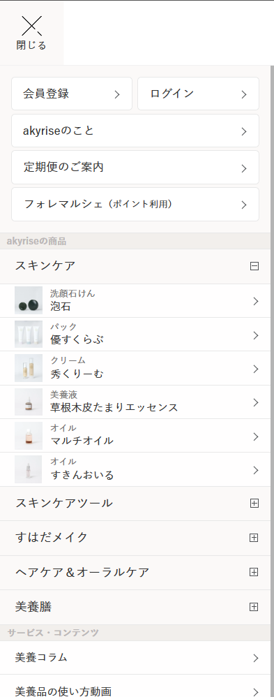

サイト制作依頼文
## ECサイト VIEOTY 制作依頼内容まとめ
ターゲット: 50歳女性 * コンセプト: 高級オーガニック **2. デザインイメージ** * 全体的な雰囲気: 上品で洗練された印象、高級感と親しみやすさのバランス
■パッケージ・ラベルイメージ
 
* **VIEOTY:** 箔押しシルバー
* **ロゴ:** #b2a2b9 (薄い紫)
* **その他の文字:** #231815 (黒)、#5d4037 (濃い茶色)、#79645e (紫がかった茶色)
ちなみに以下がイメージとなります。 

 
 
### お支払い分の制作が終わってから依頼　※未→LP（商品詳細ページ）: 50,000円（税込 55,000円）
* **商品ページの改善:** [https://vioty.shop-pro.jp/?pid=182998261](https://vioty.shop-pro.jp/?pid=182998261)
    * このページのデザイン、構成、コンテンツなどを改善する提案をしてください。

▽以下メモ
    
    ・無料の修正回数・範囲
    ■例えば以下のような細かい?追加はいかがでしょうか?
    ・画面上部の紫の固定メニュー?、アイコンやロゴのサイズ感のベンチマーク:https://shop.lacasta.jp/shop/(黄色不要、赤右端、青が赤の左)
    ・スクロールに合わせた表示のベンチマーク:https://www.saishunkan.co.jp/domo/(サイトのように透過?させない、背景?バックグラウンドカラーは白)
    ・上記二点をもとに弊社サイト右から・三 探す ・カートアイコン・ログイン(https://vieoty.com/secure/?mode=myaccount_login&shop_id=PA01513282)

    → 頂いた内容の軽微な修正程度であれば基本無料でご対応可能です。回数も基本制限などは設けておりません。
    1～2万の差がわかりかねますが、ご相談です。
    以前お話ししたGoogle検索機能と上記サンプルサイトのような製作追加で2万円は難しいですか?
    ※以前お話した本来ランサーズに引かれる手数料分についてです。

    こちら承知いたしました。アニメーション追加と検索機能追加で2万円で問題ございません。
    ・トップページ、ハンバーガーメニュー内、フッター、固定メニュー(画面上部の紫の固定メニュー?、アイコンやロゴのサイズ感のベンチマーク:https://shop.lacasta.jp/shop/(黄色不要、赤右端、青が赤の左)
    ・スクロールに合わせた表示のベンチマーク:https://www.saishunkan.co.jp/domo/(サイトのように透過?させない、背景?バックグラウンドカラーは白)
    ・上記二点をもとに弊社サイト右から・三 探す ・カートアイコン・ログイン(https://vieoty.com/secure/?mode=myaccount_login&shop_id=PA01513282))、コラムの追加やコラム一覧ページをサンプル際とをもとにデザイン、構成変更修正、見出しと本文のフォント、フォントサイズをどの環境でも全ページを最適化、サイト全体のカラー改善など。
    ・スマホ優先に製作いただく。

    上記4点は 『・トップページ: 30,000円（税込 33,000円）』 に作業内容として含まれております。
    
    高
    ・クリーム商品ページ改善：魅力を最大限に伝え、購入を促進
    ・ユーザビリティ向上：サイト全体を整え、回遊しやすく迷わない機能的なサイト構造に(特にトップページ、フッター、ハンバーガーメニュー)
    ・コンセプトページ改善：ブランドストーリー、世界観を効果的に表現

    上記3点も 『・トップページ: 30,000円（税込 33,000円）』 に作業内容として含まれております。
    
    ・まとめ買い促進：メリットを視覚的な訴求追加し、カートページでも訴求したい(要相談)

    こちらについては以前ランサーズチャット上にて
    ----------------------------
    >難しければ単品購入とまとめ買いでタップ時などに価格を切り替えて、タップでまとめ買い別リンクページに推移させたいです。
    こちらについてはカートを経由しない機能になると思いますので実装可能です。

    では上記でお願いいたします。
    ----------------------------
    とのご回答を頂いていたかと思いますので、タップまとめ買い時に別ページへリンクさせる方法にて対応させて頂ければと思います。
    
    ・全体のフォント・サイズ、カラーをターゲットに合うものに変える(ブランドカラーら紫※パッケージデザインは他社が制作中で、そのデザインとの統一感を出す)

    こちらも 『・トップページ: 30,000円（税込 33,000円）』 に作業内容として含まれております。
    中
    ・販売前商品紹介：魅力的なビジュアルと公式LINEへの導線

    こちらも 『・トップページ: 30,000円（税込 33,000円）』 に作業内容として含まれております。

    ・動画/画像によるブランド表現：ファーストビューで世界観を伝える動画/アニメーション検討

    こちらにつきまして、動画は含まれておりませんが
    ファーストビューアニメーションについては 『・アニメーション制作/検索機能: 20,000円（税込 22,000円）』 のお見積りに含まれております

    低
    ・SEO対策：ブランド名、商品名の検索結果を整理
    ・送料無料表示を目立たせる

    SEO面は主に meta タグの整理（検索エンジンへの対応、検索結果表示内容や各種SNSでの表示内容）を対応予定です。
    こちらも 『・トップページ: 30,000円（税込 33,000円）』 に作業内容として含まれております。

    
    販売前商品紹介ページへ、魅力的なビジュアル（トップページやLPと似たようなデザインに整える、ブランドイメージが落ちないビジュアル） + LINEへの導線 で、
    トップページのお見積とまとめて + 5,000円 でご対応させて頂ければと思うのですが、いかがでしょうか。

    作業前のバックアップデータを共有させて頂いた上で作業開始させて頂きます。
    また念のためテンプレートの複製を実施させて頂き、複製したもので作業進める予定です。
    都度更新は実施しますが、完了次第、完成したテンプレートを反映させるため
    見た目的には納品前にまとめて更新されるように見るかと思います。

    今週はコード把握などがメインとなりますので来週から本格作業はいれればと思います。
    一応毎週月を目途に進捗報告させて頂ければと思います。
 
■サイトアクセス時などのロゴの表現(要相談)
以下のサイトがイメージとなります。
 
https://www.sisley-paris.com/ja-JP/%E3%83%98%E3%82%A2-%E3%83%AA%E3%83%81%E3%83%A5%E3%82%A2%E3%83%AB-%E3%83%95%E3%82%A9%E3%83%BC%E3%83%86%E3%82%A3%E3%83%95%E3%82%A1%E3%82%A4%E3%83%B3%E3%82%B0-%E3%82%B7%E3%83%A3%E3%83%B3%E3%83%97%E3%83%BC-100201.html?ldtag_cl=sMmKRSpBQT6T46tbxHq1AgAA_oa(

> memo: ロゴの表現
> トップページを開いた際に
> VIEOTY のロゴをフェードアウトして表現する。 
> 動画がはいるのでローディングをごまかすためにいれたい！
>
> https://dextar.co.jp/ のロゴ表示に近いイメージ
> 
> 
> 

■動画(どのタイミングで動画素材は確定すべきか、要相談)
・動画ではラベンダーの花とロゴやタグラインを。(後程パッケージデザイナーからイラレ?で素材提供されます)
▼
動画イメージ:https://www.shutterstock.com/ja/video/clip-18570527-close-up-woman's-hand-running-through-sunny-lavender
イメージ2:https://www.shutterstock.com/ja/video/clip-1102305261-female-hand-tenderly-touching-tops-purple-flowers
イメージ3夕焼け:https://www.shutterstock.com/ja/video/clip-18570569-close-up-woman's-hand-running-through-sunny-lavender
イメージ4青空、緑:https://www.shutterstock.com/ja/video/clip-30097627-hippie-girl-walking-lavender-field-summer-freedom
イメージ5人物なし:https://www.shutterstock.com/ja/video/clip-1096481547-smooth-rows-lavender-plants-blooming-flowers-bright
追加で女性用で髪と肌の化粧品だとわかり、年齢層40代まで表現できるかなど相談

> memo:
> PCは割となんでもいい
> SPは Top に動画を入れたい  → 来年あたりに考える。一旦画像を何枚か切り替えられるように
> 対象は教育しきっているユーザーターゲットなので動画での訴求で問題なさそう

■フォント、カラーなど全ページ改善
・サンプルサイトA: [https://www.coyori.com/] ブランドカラーの使用頻度などのバランス、機能面やフォント、見出しやプライス、画像内、本文の使い分けや強弱の仕方、リズム感(テキストに大小、縦、中央、右揃え)など参考に

・カラー希望
ブランドカラー: #b2a2b9 (VIEOTYのロゴはb6bac5)
*ラベンダーの花のロゴ: #b2a2b9 (薄い紫)
*本文: #79645e (紫がかった茶色)
* 見出し: #594a4e (本文より濃いめの色)
* 背景: #f8f5f0 (薄いベージュ)
* アクセントカラー: #a37ba8 (濃い紫)
セカンダリボタンやリンクなどに使用
* ボーダー: #e6e1d9 (薄いグレー)
* エラーメッセージ・割引後テキスト: #d9534f (赤)
・CTA
ボタンの色: * 例1: 背景 #b2a2b9 (薄い紫)、テキスト #ffffff (白) * 例2: 背景 #a37ba8 (濃い紫)、テキスト #ffffff (白) * 例3: 背景 #ffffff (白)、テキスト #b2a2b9 (薄い紫) * ボタンの形: 角丸

※デザインに起こした場合イメージと異なる可能性がありコントラストなど微調整お願いいたします。
※本文と見出しのフォントカラーサンプルサイト https://es.akyrise.jp/index.cgi (プライスなどは黒?を使用)

※フォント** * 全体的なフォント戦略はサンプルサイトAをご参考ください。

以下は選択肢としてご参考ください。
Serif系のフォントをベースに、高級感と自然体の両立を図りつつ、オーガニックな雰囲気も取り入れる。
・フォントファミリー
* 日本語: * 見出し: 筑紫アンティーク明朝 (オーガニックな高級感)
* 本文: 游ゴシック体 (可読性と高級感)
* 欧文: * 見出し: Didot (エレガント) * 本文: Open Sans (シンプルで汎用性が高い)
* その他候補: * 日本語: * 見出し: A1明朝, ヒラギノ明朝 ProN W6, TP明朝 * 本文: ヒラギノ角ゴ ProN W3, Noto Sans JP * 欧文: * 見出し: Bodoni, Garamond * 本文: Lato, Roboto 
 
> memo:
> フォントについては  https://www.coyori.com/ のようなイメージにしたいけど 
> 商品部分のテキストは明朝体つかわないようにしたい。ブランドカラーを出しすぎない
> 可読性をみつつ 見出し,本文については  https://es.akyrise.jp/index.cgi

 
■トップページ構成改善

アニメーションなどの参考サイト
https://makanaibeauty.jp/

> memo:
> アニメーションについて
> makanai 6 で vieoty 4 くらいな感じでアニメーションいれたい
> なるべく視認性や読み込まれない等のリスクは減らしたい

> memo: 
> コラム一覧ページについてはについては 現在 https://vieoty.com/ のページの
> message の↓に配置するイメージ
> 
> カテゴリ自体は 4-6 個つくる感じになる
> カテゴリの内容は
>     https://vieoty.com/?mode=f24
>     内に記載のある
> 
>     カテゴリー一覧6つのパターン
>     - エイジングケアの基礎知識
>     (イメージ画像)
>     年齢を重ねるごとに変化する肌や髪。50代からのエイジングケア*? 年齢に応じたお手入れのことに必要な知識を深め、自信に満ち> た美しさへと導きます。季節に合わせたスキンケア・ヘアケア方法から、頭皮や肌悩みの解決策、そして理想の化粧品との出会い方> まで、専門的な情報をお届けします。
> 
>     - ヘアケア＆スキンケアのHow to
>     (イメージ画像)
>     毎日のヘアケア＆スキンケアを、ワンランク上のステップへ。正しい洗顔方法から、頭皮と顔・体の皮膚の違い、そして自分に合っ> たシャンプー選びまで。丁寧な解説で、あなたの美しさを最大限に引き出します。
> 
>     - 成分辞典
>     イメージ画像
>     化粧品の成分を正しく理解することは、美しさへの近道。シリコン、自然由来指数、無添加など、気になるキーワードを分かりやす> く解説し、あなたに最適な化粧品選びをサポートします。
> 
>     - インナービューティー
>     イメージ画像
>     真の美しさは、内側からも育まれます。美容家電の効果や特徴から、美肌・美髪を育む食品、サプリメントの効果まで。美と健康を> 追求する、あなたのための情報をお届けします。
> 
>     - 化粧品業界の真実
>     イメージ画像
>     本当に良い化粧品を選びたい。 そんなお客様の想いに応え、HERAIが長年培ってきた知識と経験を基に、化粧品業界の「真実」をお> 伝えします。正しい情報を知り、賢く化粧品を選ぶことで、あなただけの美しさを手に入れてください。
> 
>     - VIEOTY商品ガイド
>     イメージ画像
>     VIEOTY商品をもっと深く理解し、あなたの魅力を最大限に引き出すためのガイド。各商品の具体的な使い方や特徴はもちろん、あな> たにぴったりのお手入れ方法までご紹介します。VIEOTY商品を通して、ワンランク上の美しさを体感してください。
> 
> 
> 
> トップページに配置する際はコラム一覧は↑のイメージ
> 
> コラムページは一覧は
> 
>     ↑のような形でタブにしたい or カテゴリごとに画像を持たせたい
> 
>     下記カテゴリ一覧ページについては
>     https://vieoty.com/?mode=f24
>     今回作業対象ではなかったので、再度見積します
>     できればワイヤー程度のデザインもあるとよい

https://www.coyori.com/
https://shop.lacasta.jp/shop/
・６枚(６カテゴリー)のアイキャッチだと視認性が悪い場合スライダーなど要相談
遷移先ぺーページ、コラム一覧改善→https://vieoty.com/?mode=f24
・ コラム一覧ページでは、ほしい情報をすぐに見つけられるように、各ページの下部に関連記事を表示、タブなどでカテゴリーを切り替えられるように。
* 参考サイト: 
        (https://shop.lacasta.jp/shop/pages/column.aspx)
        * [https://www.hana-organic.jp/column/]

https://www.saishunkan.co.jp/domo/

※ブランド名由来セクションでVIE . O . TYの意味を説明しており、添付ファイルにあるようにテキストを繋げています。
アニメーションor動画などで視覚的に訴求できたらと思います。
※・ユーザビリティ向上：サイト全体を整え、回遊しやすく迷わない機能的なサイト構造に(特にトップページ、フッター、ハンバーガーメニュー))いただきたいです。

まとめ買い促進：メリットを視覚的な訴求追加

https://vieoty.com/?mode=cate&cbid=2934070&csid=0
クリームのＬＰやトップページなど要相談

> memo:
> 60日間返金保障
> まとめ買いで何パーセントおふになるか
> ヴィジュアル（画像）を作る
> 
> 設置する場所は
>     ・Topページと - 設置個所はお任せ（ブランドイメージを崩さないように）
>         継続から、確かな実感に の前あたりがいいかもしれない
>         - 訴求内容
>         割引のパーセンテージは決まっているけど、価格はきまっていない
>         Fix次第ご連絡いただく
> 
>     ・まとめ買い促進ページ（今回は対象でないので別途お見積り）
>         https://vieoty.com/?mode=cate&cbid=2934070&csid=0

■3STEP(販売前ページの改善)
https://vieoty.com/?mode=cate&cbid=2932336&csid=0
販売前商品紹介：魅力的なビジュアル、トップページやLPと似たようなデザインに整える、ブランドイメージが落ちないビジュアル） + LINEへの導線

3STEPの訴求デザインイメージ、商品画像は仮でいれ(カミングスーン＋商品名＋機能面)、後からテキストも編集できるように

> memo: 
> 薬機法の関係などでテキストが変わる可能性があるので
> できればコーディングベースでつくってほしい
> 3ステップで流れをメインにつくる
>
> 
> 
> キャッチコピー は↑の画像のようにしたい
> テキストは仮でOK。後で Herai 様の方で入力いただく
> アコーディオンの部分はオプション的な感じでOK。

    
■フッター・メニュー改善サンプルサイトhttps://www.saishunkan.co.jp/domo/

> memo:
> フッター部分は下記のようにしたい
> 
> 
> 
    

・商品画像を参考サイト: [https://es.akyrise.jp/support/guidance.cgi](https://es.akyrise.jp/support/guidance.cgi) (左上メニュー内)のように加えるか要相談。

> memo:
> ハンバーガーメニューは
> 
> 
> 
> のようにしたい。商品画像は仮でOK

   
■ブランドコンセプトページ改善
 
* ブランドコンセプトページのデザインを改善してください。
    * https://vieoty.com/?mode=f9
 
    * 参考にしたサイト: [https://shop.lacasta.jp/shop/pages/about_lacasta.aspx#sec_1]
    

> memo:
> ブランドコンセプトページは 
> https://vieoty.com/?mode=f9  
> こちらも別ページになるので 
> 別途お見積り
    
 
 
#### その他
 
* 上記はあくまで一例です。サイトのデザインや構成に合わせて、フォントのサイズやウェイトなどを調整してください。
* 改善した箇所は、納品後に私たちが自由に編集できるように、HTMLやCSSなどのコードで共有してください。
* 画像の推奨サイズなど、後から変更できるように教えてください。
 
 
■SEO対策
 
* ブランド名や商品名をウェブ検索したときに表示される項目を整理・設定してください。
    * 具体的には、検索結果に表示されるタイトル、説明文、URLなどを適切に設定してください。
    * 例えば、Google検索で「ヴィオティー」と検索した際に、検索結果に表示されたときの表示について。

▽サンプル

赤のようにブランド名だけに
オレンジのように目的のページにすぐアクセスできるように

> memo:
> ↓のようなイメージ
> 
>  赤はドメイン名
 
 
 
## 作業内容の詳細
 
* トップページ: 30,000円（税込 33,000円）
    * トップページのデザイン、ハンバーガーメニュー、フッター、固定メニューの改善
    * コラムセクションの追加
    * コラム一覧ページのデザイン、構成
    * 見出しと本文のフォント、フォントサイズをどの環境でも最適化
    * サイト全体のカラー改善
    * スマホ対応
    * クリーム商品ページの改善
    * ユーザビリティ向上
    * コンセプトページの改善
    * まとめ買い促進
    * 全体のフォント・サイズ、カラーの変更
    * 販売前商品紹介
    * SEO対策
* アニメーション制作/検索機能: 20,000円（税込 22,000円）
    * ファーストビューアニメーション
* LP（商品詳細ページ）: 50,000円（税込 55,000円）
    * 商品詳細ページのデザイン、構成、コンテンツ改善
 
> memo:
> 上記作業範囲で問題ありません

> memo:
> 下記画像の通り
> media の上部に インスタ
> media の下部に News
> また LINE連携
> を追加する
> 
> 
